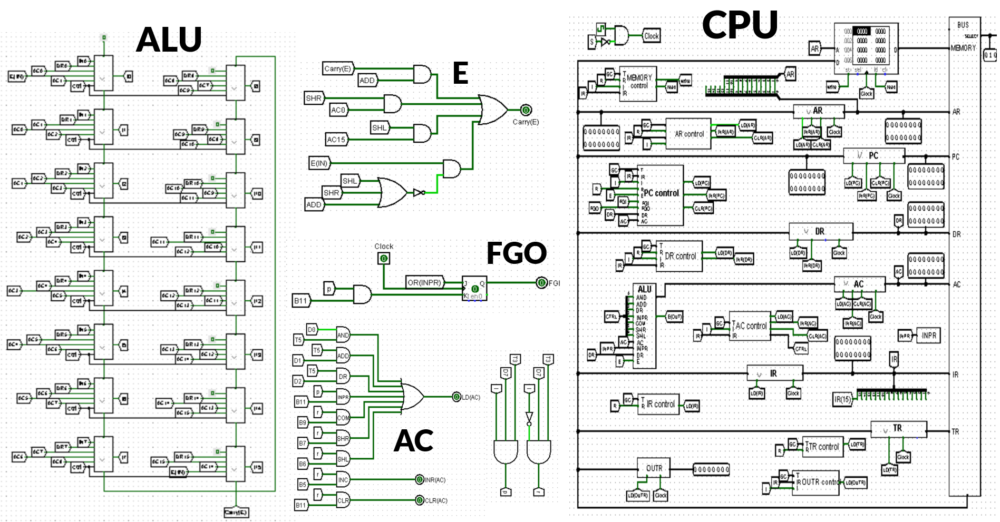

# Morris Mano Basic Computer Design using Logisim

## About The Project

This project is part of a Computer Organization course and aims to design a functional CPU, including an Arithmetic Logic Unit (ALU), and other essential components.

### Hardware Components

The Morris Mano Basic Computer consists of the following hardware components:

- **Memory Unit**: 4096 words, each 16 bits wide.
- **Registers**: Nine registers including AR (Address Register), PC (Program Counter), DR (Data Register), AC (Accumulator), IR (Instruction Register), TR (Temporary Register), OUTR (Output Register), INPR (Input Register), and SC (Sequence Counter).
- **Flip-Flops**: Seven flip-flops representing various control and status flags: I (Interrupt), S (Stop), E (Enable), R (Read/Write), lEN (Input Enable), FGI (Input Flag), and FGO (Output Flag).
- **Decoders**: Two decoders: a 3 x 8 operation decoder and a 4 x 16 timing decoder.
- **16-bit Common Bus**: Used for data transfer between different components.
- **Control Logic Gates**: Responsible for control signals generation and management.
- **Adder and Logic Circuit**: Connected to the input of the Accumulator (AC) for arithmetic and logical operations.

## Built With

The Morris Mano Basic Computer was designed using **Logisim**, a digital circuit design and simulation tool. Logisim provides a visual environment for designing, simulating, and testing digital circuits.
